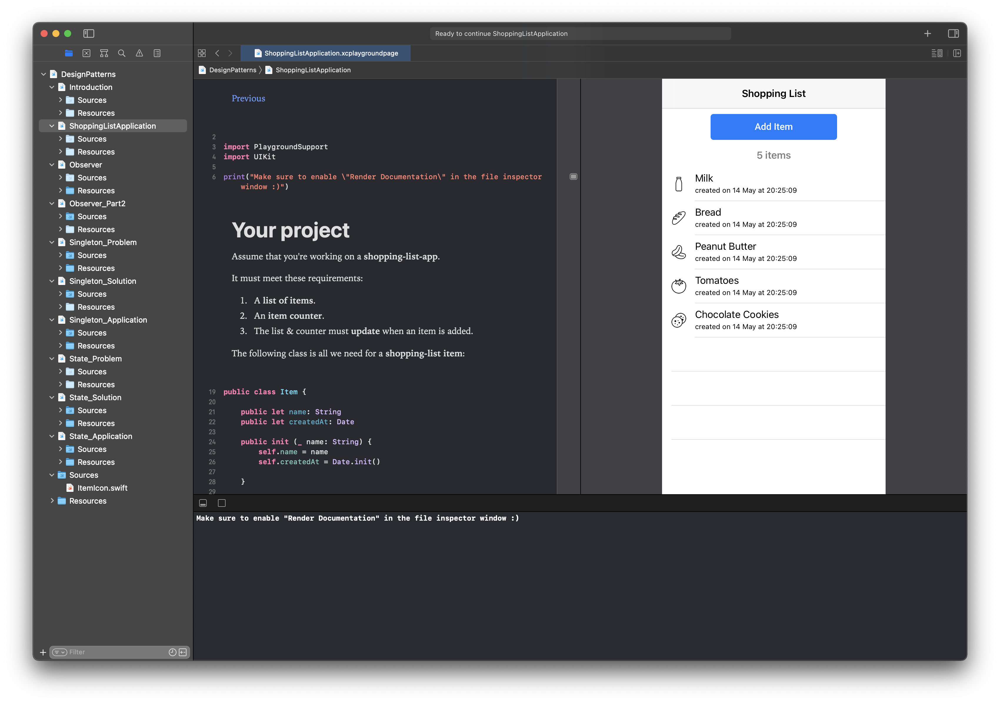
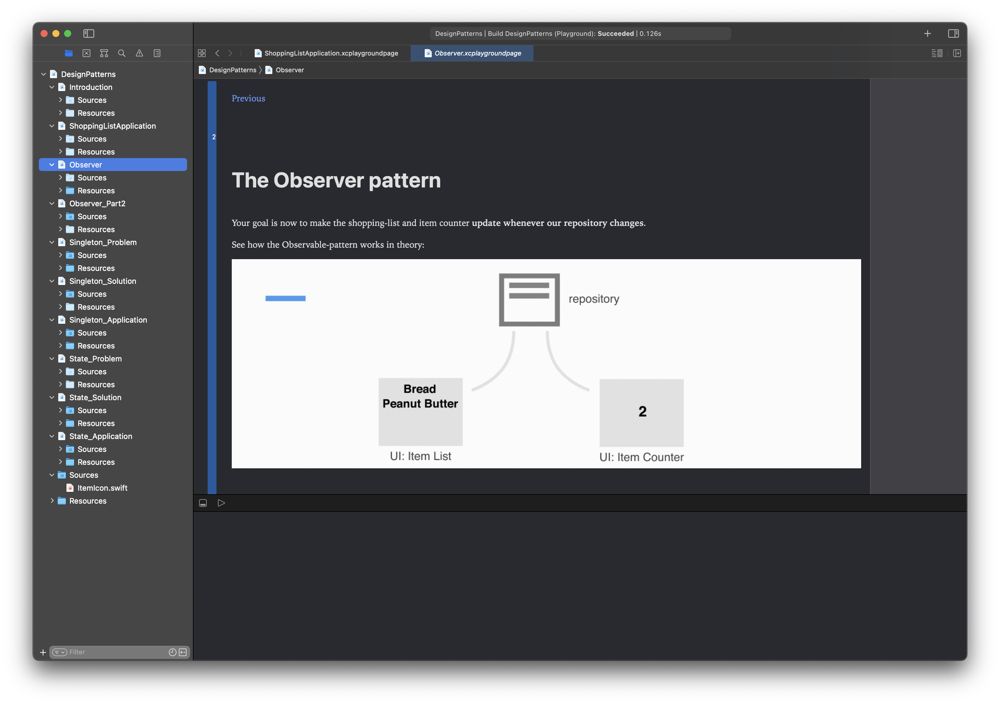
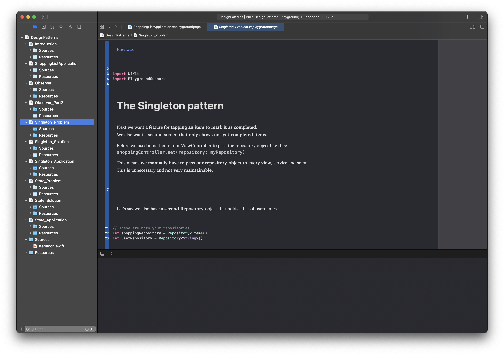

# DesignPattern-Playground

This is my (accepted) submission for the 2018 WWDC Scholarship. It teaches the following design patterns of object-oriented design:
- Observer
- Singleton
- State

It does so by letting the user implement the core elements of an iOS application that runs in Xcode's live preview and directly reflects the changes the user makes to show the design patterns at work.

Additionally, the patterns are explained using a description, images and animations.

This submission was chosen by Apple for a WWDC 2018 scholarship, which allowed me to attend the popular developer conference in San Jose.

## Links

Feature on [SPIEGEL Online](https://www.spiegel.de/netzwelt/gadgets/apple-wwdc-2018-sag-auf-einer-party-nie-dass-du-was-mit-computern-machst-a-1210593.html) (German only)

Feature on [BILD](https://www.bild.de/digital/multimedia/apple-wwdc/junge-entwickler-bei-apples-wwdc-55929468.bild.html) (German only)

## Screenshots

